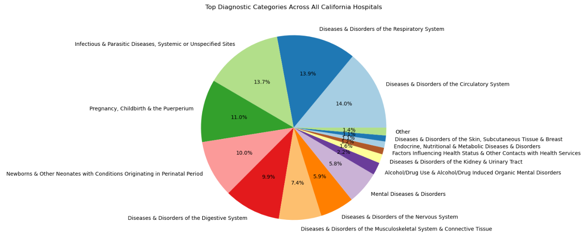
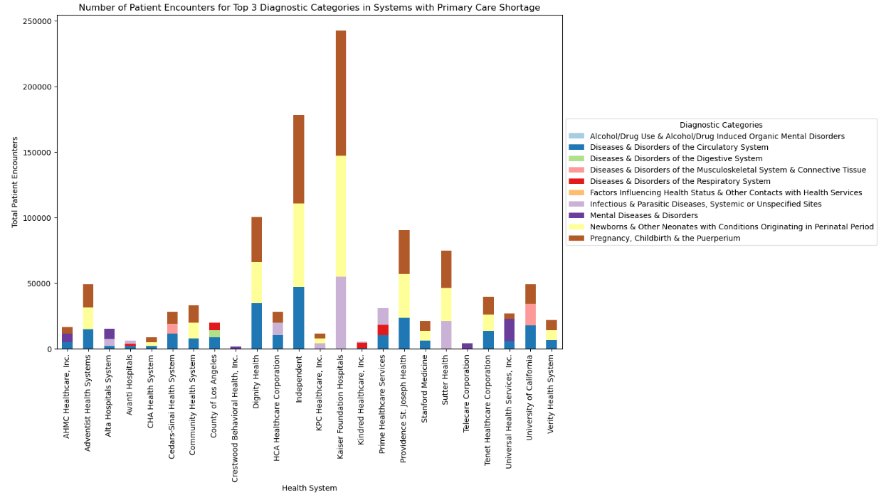
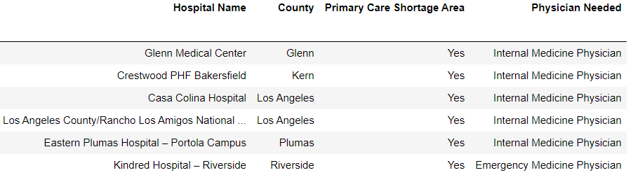
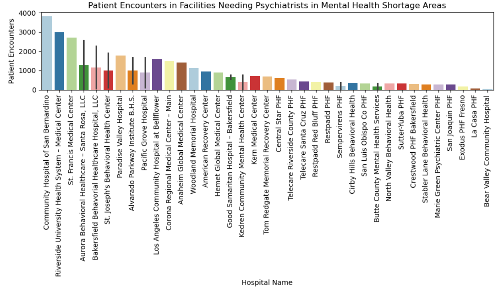
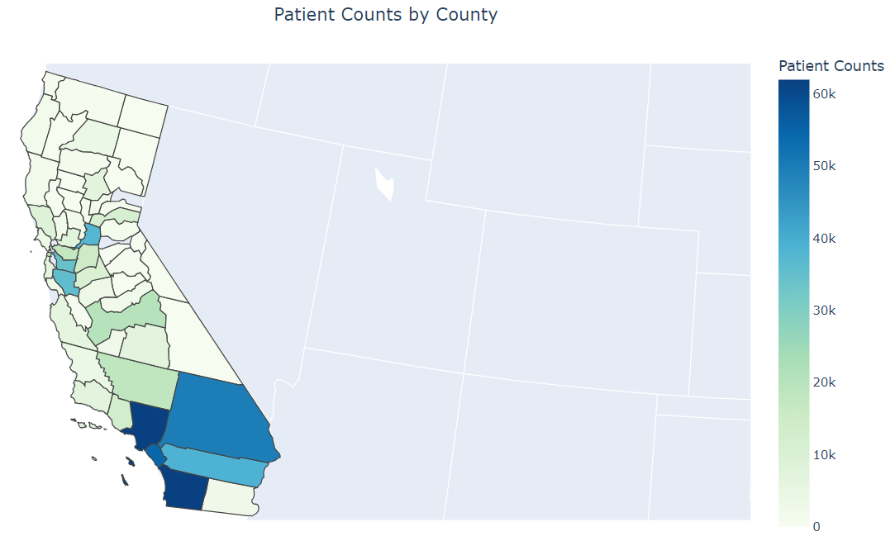
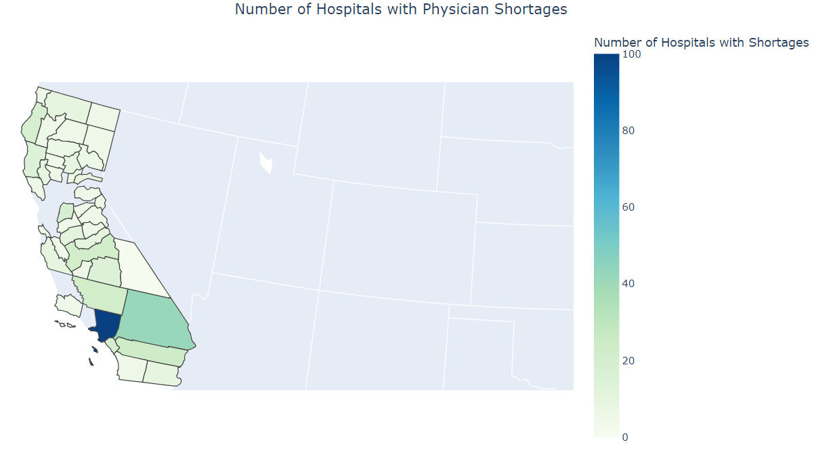

# Health Maps

#### California Hospitals Resource Allocation Data Analysis Project 

## About this Project

### Dataset
This project utilizes data from the California Health and Human Services Open Data Portal, which provides information on the Top Five Major Diagnostic Categories (MDCs) for inpatient diagnoses across all California hospitals. The dataset, sourced from Patient Discharge Data (PDD), details the frequency of these diagnostic categories in various hospitals, offering a comprehensive view of the most common medical conditions in the state.

### Description/Motivation
The project aims to analyze this data to identify prevalent MDCs across hospitals, assess the need for primary care and mental health professionals, and determine the demand for specific physician specialists. By pinpointing where additional healthcare resources and professional expertise are most needed, the project supports effective resource allocation, addresses physician shortages, and can help inform health policy decisions.

### Key Analysis Questions
1. Which Major Diagnostic Categories are most prevalent in California hospitals?
2. Which Major Diagnostic Categories are most prevalent across different health systems with Physician Shortages?
3. Which hospitals are in need of primary care physicians to meet patient demands?
4. Which mental health facilities are in need of mental health specialists to meet patient deamnds?
5. How does region and healthcare system influence the types of common diagnoses and patient volumes?
   a.   Is there a healthcare system lacking in resources?

### Results

1. Diseases related to the  **Respiratory System**, **Infectious Diseases**, **Pregnancies/Childbirth**, and **Complications with Newborns/Neonates** are the most prevalent Diagnostic Categories in California.

&nbsp;

2. **Pregnancies/Childbirth**, **Complications with Newborns/Neonates**, **Infectious Diseases**, and **Circulatory System Diseases** are the most prevalent Diagnostic Categories in various health systems with **Physician Shortages**.

&nbsp;

3. The above 6 hopsitals should be the top priority to meet the demands of filling Primary Care Provider positions at there hospitals due to them being in Primary Care shortage areas and having high counts of patient admissions for diseases needing a Primary Care Provider. 

&nbsp;

<!-- ROADMAP -->

## Roadmap
- [X] Data Importation and Cleaning
  - [X]  Imported data using API calls 
  - [X]  Cleaned data by replacing missing values and adding additional features
- [X] Exploratory Data Analysis (EDA)
- [ ] Create interactive visualizations
- [ ] Tableau Dashboard 

<!-- LICENSE -->
## License
Distributed under the MIT License. See `LICENSE.txt` for more information.

<!-- CONTACT -->
## Contact

Neha Humbe - nehahumbe@ucla.edu

Project Link -  https://github.com/nmhumbe/CreditScoreClassification

<!-- ACKNOWLEDGMENTS -->
## Acknowledgments
* [CalHHS Dataset](https://data.chhs.ca.gov/dataset/top-five-major-diagnostic-categories-mdcs-for-california-hospitals/resource/59942195-7c44-40d3-93bb-48adc5809bd9)
* [Choropleth Maps](https://plotly.com/python/choropleth-maps/)
* [README Template](https://github.com/othneildrew/Best-README-Template)
   
